## Heya! 👋

I'm **Udhay**, a Cybersecurity-focused Computer Science undergraduate with hands-on penetration testing, network security, and secure full-stack development experience.

- 🔭 Currently building **AI-SOC-Analyst** — a privacy-first, local AI assistant for SOC analysts and threat hunters
- 🔐 Completed a cybersecurity internship applying VAPT methodology (Burp Suite, Nmap, sqlmap, Hydra, Wireshark, OWASP ZAP, Metasploit)
- 🏆 Placed **Top 2** at Smart India Hackathon leading a 6-member team
- 🧑‍🤝‍🧑 Co-founded and leads a **300+ member** technical community (RedHat Squad)
- 🌱 Currently focused on: **AWS cloud security · SOC workflows & threat detection · DevSecOps · CTF**
- 📫 Open to: Cloud Security / SOC / DevSecOps internships & security research collaboration

---

## 🛠 My Stack

**Security Tooling**

**Core**

**Cloud & Web**

**AI / Automation**

---

### 📚 Things I've Built

|  |  |
|---|---|
| **🤖 [AI-SOC-Analyst](#)** · 🚧 Building   Privacy-first, local AI assistant for SOC analysts and threat hunters. RAG-based chat over the MITRE ATT&CK dataset, automated PDF threat-report summarization, and IoC extraction — powered by local LLMs (Phi-3 / LLaMA 3 via Ollama) so no data leaves your device | **🛡 [airscope](https://github.com/udhaybhat00/airscope)**   Cross-platform USB Wi-Fi security auditor: WPA/WPA2 handshake + PMKID capture, WPS PixieDust, WPA3 SAE, EvilTwin, hashcat cracking — terminal UI + web dashboard |
| **🛒 [VisionHub](https://github.com/udhaybhat00)** · [Live](https://visionhubstore.vercel.app/)   Full-stack eyewear e-commerce platform (Next.js 16, React 19, TypeScript) with secure Razorpay payments, an AI Stylist virtual try-on (MediaPipe Face Mesh), and Clerk auth with RBAC | **🔎 [LoginFinder](https://github.com/udhaybhat00/Login-Finder)**   CLI tool for discovering hidden login portals in authorized security assessments |

---

## 👔 Experience

| Position | Company | Title | Work Period |
|---|---|---|---|
| **Intern** | **The Red Users** | **Cybersecurity Intern** | **12-2024 — 12-2024** |
| **Intern** | **Sri Venkateshwara College of Engineering** | **Web Development Intern** | **12-2024 — 11-2025** |

## 🎓 Education

- **B.E., Computer Science & Engineering (Cybersecurity)** @ Sri Venkateshwara College of Engineering, Bangalore (Affiliated to VTU) — CGPA 8.1/10.0 — *Expected May 2027*

## 🏅 Leadership & Activities

- **Co-President & Webmaster Head**, RedHat Squad, SVCE — Co-founded and grew a 300+ member technical community; led 2+ workshops
- **Webmaster & Treasurer**, IEEE Student Branch, SVCE — Supported and volunteered across multiple IEEE conferences and technical events

---

## 🎯 Certifications

- Network Defense Essentials (NDE) — EC-Council, Oct 2023
- World Wide CTF 2024 — World Wide Flags, Nov 2024
- Introduction to Cloud Security
- Introduction to Programming Using Python

**Next up:** Security+ · AWS Security Specialty · Splunk Core Certified User · Microsoft SC-200 · eJPT

---

## Contributions

<picture>
  <source media="(prefers-color-scheme: dark)" srcset="https://raw.githubusercontent.com/udhaybhat00/udhaybhat00/pacman-output/pacman-contribution-graph-dark.svg">
  <source media="(prefers-color-scheme: light)" srcset="https://raw.githubusercontent.com/udhaybhat00/udhaybhat00/pacman-output/pacman-contribution-graph.svg">
  
</picture>

---

## 🤝 Let's Connect

Open to: **Cloud Security internships · SOC/Blue Team internships · DevSecOps internships · Security research collaboration**
